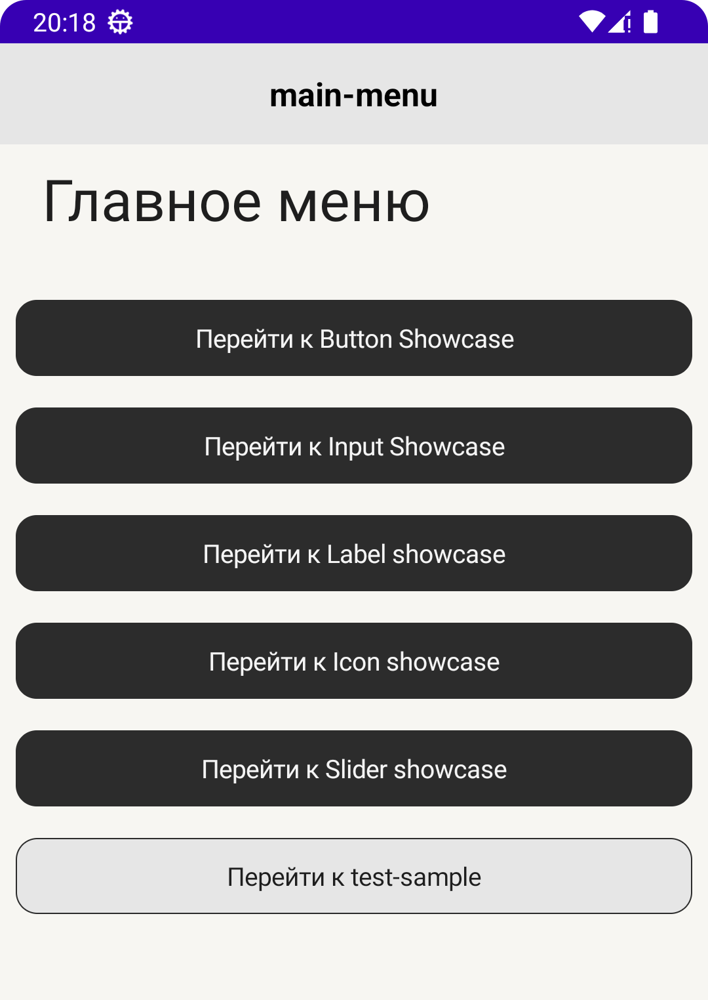
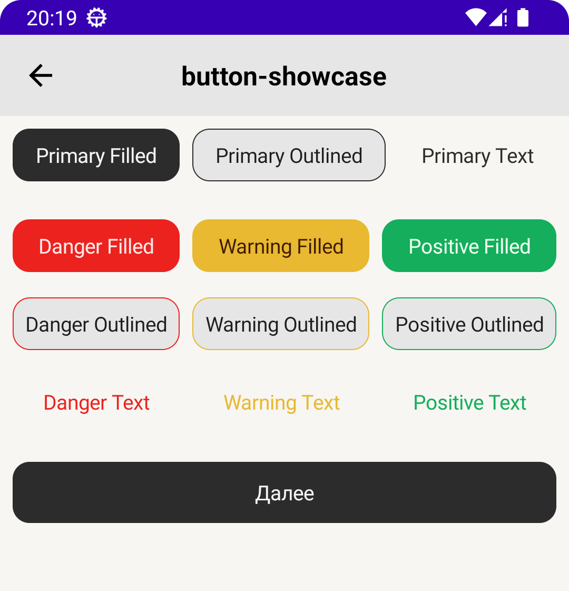
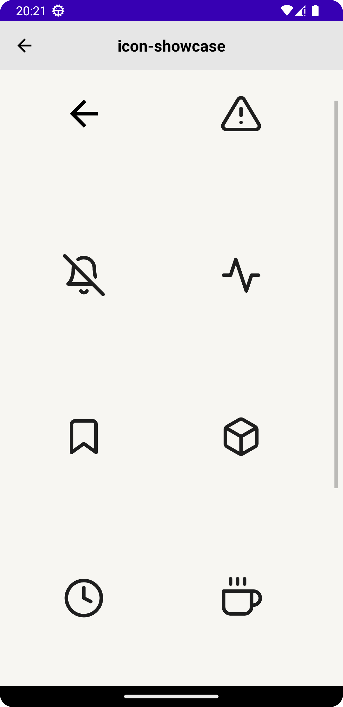
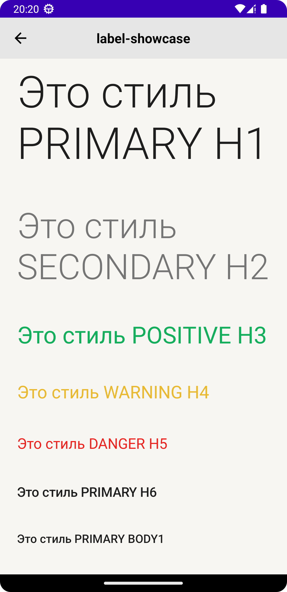
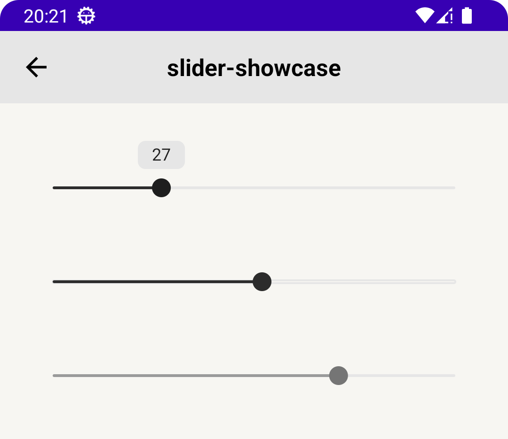

# BDUI App

Android-приложение с нативными UI-компонентами, собранными из JSON-описаний.

## Возможности

- Динамическая отрисовка экранов на основе JSON-конфигураций
- Набор готовых UI-компонентов: кнопки, текстовые поля, лейблы, иконки, слайдеры
- Локальная загрузка макетов (не требует подключения к серверу)

### Примеры JSON

Готовые примеры JSON-макетов всех экранов определены в [Constants.kt](app/src/main/java/com/shadi777/bduiapp/Constants.kt).

## Скриншоты

Все что показано на скриншотах собирается полностью на основе JSON конфигураций, включая переходы между экранами.

### Главное меню

### Разные виды кнопок

### Иконки

### Различные стили текстов

### Слайдеры

## Структура проекта

- **app** — приложение-хост (Activity, навигация)
- **bdui** — библиотека UI-компонентов и парсинга JSON-макетов
- **design** — базовая библиотека UI-компонентов и стилей

## Архитектура

Экраны приложения собираются из JSON-описаний по принципу declarative UI.

### Модель экрана

Каждый экран — это JSON-дерево, где каждый узел имеет поле `type`, определяющее тип компонента:

- **ViewGroup** — контейнеры: `Column`, `Row`, `Scroll`
- **View** — компоненты: `Button`, `Label`, `Icon`, `Slider`, `TextInput`, `Loader`

Каждый компонент поддерживает свойства `layout` для позиционирования и (для `Button`) `action` для обработки нажатий (навигация, toast, reload).

### Ключевые модели

| Модель | Описание |
|--------|----------|
| `BduiConfig` | Конфигурация экрана, содержит только `key` |
| `BduiModel` | JSON-дерево экрана (sealed class с дискриминатором `type`) |
| `BduiAction` | Действия для компонентов (`Navigate`, `ShowToast`, `ReloadScreen`, `Custom`) |

### Пайплайн

1. `BduiConfig` передаётся в `BduiScreenViewModel` по `key`
2. ViewModel загружает JSON-строку по ключу (из `Constants.kt`)
3. `BduiMapper` рекурсивно преобразует JSON-дерево в Android `View`
4. Готовый `View` отображается в `BduiScreen`

## Сборка и запуск

1. Откройте проект в Android Studio
2. Синхронизируйте Gradle-проекты
3. Запустите приложение на эмуляторе или устройстве
